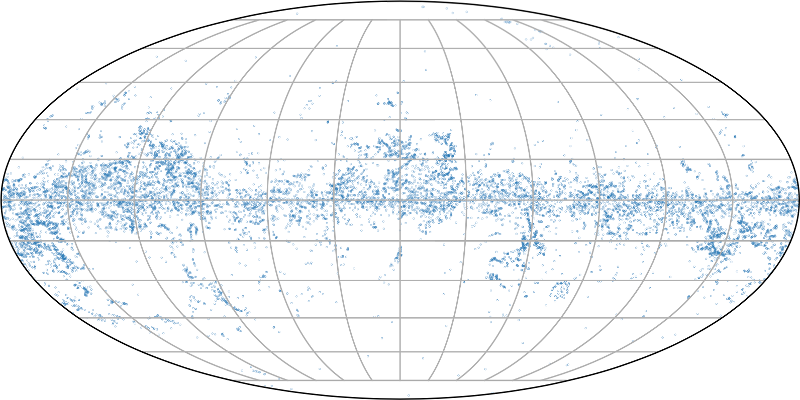
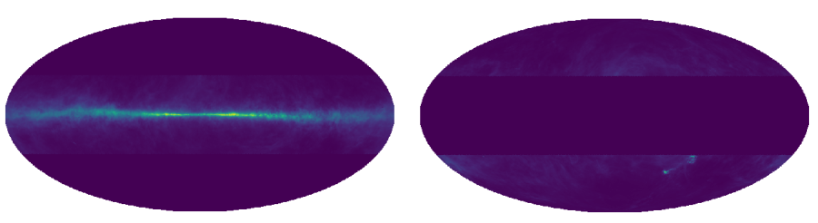

# PGCC-Analyser
The PGCC-Analyser is a tool to find informations about PGCC's in a selected area based on complementary datasets. This program provides a selection tool, preset filters and regions, a PGCC neighbourhood- and CO-analyser and some visualisation methods.

<p align="center">
  
</p>


## Introduction 
To find the properties of <em>Planck Galactic Cold Cores<em> (PGCC's) for my Bachelorthesis "Erstellung eines Katalogs von galaktischen cold clumps im Halo der Milchstraße" (<em>Creation of a catalog of galactic cold clumps in the milky way halo</em>) I created the PGCC-Analyser. This tool get's PGCC properties from complementary datasets like the Effelsberg HI4PI-Survey, PLANCK (353, 545 and 857GHz)-, IRAS (3THz)-data and products of them (Dusttemperature Maps R1 & R2, Dame-CO-Map). The positional information is received by the original PGCC-Catalouge. To obtain the information and to build a new catalouge, every map was projected on an npix=1024 healpix-grid. Every PGCC-datapoint is collected in a pandas dataframe and averaged by the 7 surrounding points. The total angular resolution is about 16.2' and corresponds to the resolution of the HI4PI-Survey. In total every PGCC entry has nine properties (N_HI, I_3THz, I_857GHz, I_545GHz, I_353GHz, Color, T_Dust_R1, T_Dust_R2,  CO). The main analyser return's informations about all selected PGCC's, their strangeness and neighbourhood information. To learn more, read the [thesis](#the-thesis).
  
- [PGCC-Analyser](#pgcc-analyser)
  * [Introduction](#introduction)
  * [The thesis](#the-thesis)
  * [Before you start](#before-you-start)
    + [Hardware requierements](#hardware-requierements)
    + [Dependencies](#dependencies)
  * [Using the analyser](#using-the-analyser)
    + [First steps](#first-steps)
    + [Output](#output)
    + [Known Issues](#known-issues)
 
## The thesis
The thesis will be available soon.

## Before you start
The analyser is written in python3 and a frontend provided as a jupyter notebook. The healpy packages only supports macOS and Linux operating systems. To use it on Windows you will have to use the Windows Subsystem for Linux. For this matter consult the [healpy wiki](https://healpy.readthedocs.io/en/latest/install.html)

### Hardware requierements
Since the analyser uses big datasets lot of RAM is an advantage. Most of the used packages run on single cores. Since the code isn't optimised for multicore tasks the program gets slow on very old CPU's. 
* at least 16 GB of RAM + Swap (more RAM makes the analyser faster)
* at least 10 GB free storage for datasets
* CPU with good single core performance
* Using Linux or macOS. For Windows you'll need to use the 'Windows Subsystem for Linux'. I never tested the analyser on such a system.


### Dependencies
The following packages are requiered:

```
pip3 install jupyterlab notebook numpy matplotlib scipy pandas healpy astropy
```

You'll also need to download all datasets. You can do so by using the provided bashscript.
```
sh ./download_data.sh
```
It will download all requiered datasets except the PGCC-Catalouge. You'll have to download it from [here](https://heasarc.gsfc.nasa.gov/db-perl/W3Browse/w3table.pl?tablehead=name%3Dplanckgcc&Action=More+Options). All datasets should be placed in the ./data folder

You can also download the datasets manually:
* [PGCC-Katalog](https://heasarc.gsfc.nasa.gov/db-perl/W3Browse/w3table.pl?tablehead=name\%3Dplanckgcc\&Action=More+Options) (Limit Results To: No Limit, Outputformat: FITS)
* [HI4PI-Columndensitymap](https://lambda.gsfc.nasa.gov/data/foregrounds/HI4PI/NHI_HPX.fits}{lambda.gsfc.nasa.gov)
* [Planck 353GHz R3](https://irsa.ipac.caltech.edu/data/Planck/release_3/all-sky-maps/maps/HFI_SkyMap_353_2048_R3.01_full.fits)
* [Planck 545GHz R3](https://irsa.ipac.caltech.edu/data/Planck/release_3/all-sky-maps/maps/HFI_SkyMap_545_2048_R3.01_full.fits)
* [Planck 857GHz R3](https://irsa.ipac.caltech.edu/data/Planck/release_3/all-sky-maps/maps/HFI_SkyMap_857_2048_R3.01_full.fits)
* [FIR IRAS 3THz map](https://lambda.gsfc.nasa.gov/data/foregrounds/iris/IRIS_nohole_4_1024_v2.fits)
* [Dusttemperature map R1](http://pla.esac.esa.int/pla/aio/product-action?MAP.MAP_ID=COM_CompMap_Dust-GNILC-Model-Temperature_2048_R2.00.fits)
* [Dusttemperature map R2](http://pla.esac.esa.int/pla/aio/product-action?MAP.MAP_ID=HFI_CompMap_ThermalDustModel_2048_R1.20.fits)
* [Dame CO-map](https://lambda.gsfc.nasa.gov/data/foregrounds/dame_CO/lambda_wco_dht2001.fits)

## Using the analyser
After every requiered package is installed and all datasets are download the analyser is ready to use.

You can run the jupyter notebook from your home directory or directly from the project folder by using the command:
```
jupyter notebook
```
In the project folder you'll find the 'Frontend.ipynb' what is everything needed.

### First steps
When sucessfully launched the notebook and downloaded all datasets you are ready to start. On every launch of the notebook you'll have to run the first code cell. You can toggle the visibility by using the upcoming 'Toggle to show/hide some requiered code' button.

Per default there is an example line to run the analyser for the orion nebula
```
preset("orion_nebula")
```
if the preset runs through everything works as intendet. All datasets will be comprimised for faster calculations on the first run.

You can use other presets or custom commands. In general the requiered command is
```
analyser(name,lon_lim_min,lon_lim_max,lat_lim_min,lat_lim_max,inverted,lon_steps,lat_steps, filter_option,show_figure, debugging, dist)
```
* name (str): Name of the selection. It will also be the folder and file name of the output data
* lon_lim_min (int/float): Limit the minimum longitude
* lon_lim_max (int/float): Limit the maximum longitude
* lat_lim_min (int/float): Limit the minimum latitude
* lat_lim_max (int/float): Limit the maximum latitude
* inverted (bool): Invert the selection

* lon_steps (int): Set the number of latitude slices 
* lat_steps (int): Set the number of longitude slices
* filter_option (str/array): Set a filter option ("LMC","SMC", "orion_nebula", "orion_super_bubble", "all")
* show_figure (bool): Should figures be shown
* debugging (bool): Show debugging figures and printouts
* dist (float/bool): Set the maximum distance for a PGCC neighborhood. Set it to 'False' to skip the neighborhood-analysis

The analyser function returns the following tables/lists:
* PGCC_info: A table of all PGCC's. It doesn't contain information about the strangeness
* strange_PGCC: A table of all strange PGCC's
* PGCC_pairs: A list of all PGCC pairs (neighbours)
* PGCC_expanded: A list of all expanded PGCC sources
* no_pgcc_list: A list of all PGCC's that build a big structure
You can use the information of the lists to find the PGCC's in PGCC_info. They only contain the pandas row identifier.

There a lot of different scripts available in this project. You can use them on the returned dataframes. A complete list will be available later in the wiki.

### Output
All generated plots and the pandas dataframe of every datapoint will be saved into the folder ./output/entered_name. You can read the dataframe from other projects by using the command
```
pandas.read_csv(filepath, sep=';') 
```


### Known Issues
The following Issues are known and maybe fixed later
* While folding the PGCC-Catatlouge positional information of 30 sources get lost
* While folding the intensity of every pixel has to change in a physical sence. Since the same intensity will be detected by two different telescopes but the angular resolution may differ, the intensity of each pixel taken from a lower dissolving telescope should be higher.
* Setting lat_steps will result into nothing

